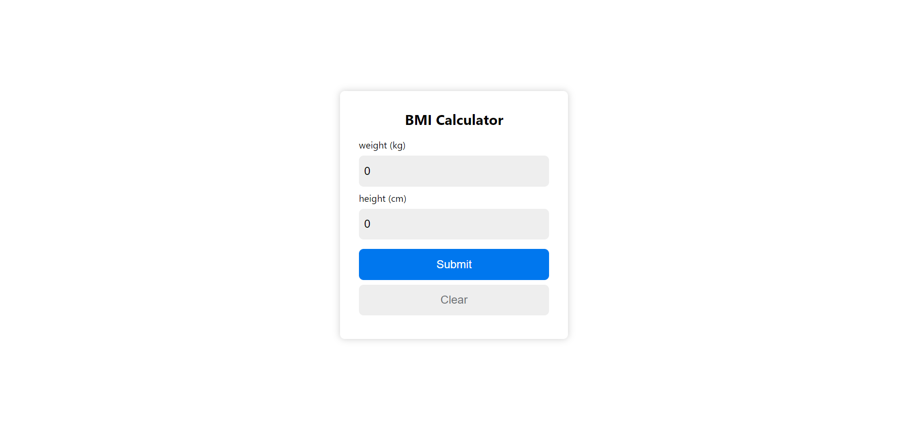

# BMI Calculator

This is a simple React-based Body Mass Index (BMI) Calculator that allows users to input their weight and height to calculate their BMI. It also provides a message indicating their BMI category (e.g., "Normal," "Overweight," "Severely Obese").

## Features

- **Real-time BMI Calculation**: Updates the BMI instantly when the user inputs weight and height.
- **BMI Categories**: Provides feedback on BMI categories, such as Underweight, Normal, and Obesity.
- **Input Validation**: Alerts users for invalid inputs.
- **Responsive Design**: Ensures usability across different devices.
- **Clear Button**: Resets the form fields and results.
- **Input Focus Handling**: Default values disappear on focus for a cleaner interface.
- **User-friendly Interface**: Simple layout with clear instructions.
- **Accessibility Features**: Designed for screen readers and keyboard navigation.
- **Styling and Theme**: Option to customize themes.
- **History Tracking**: Save and display previous BMI calculations.
- **Mobile-Friendly**: Optimized for touch devices.